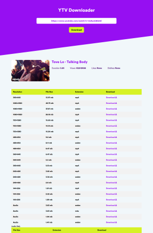

# Youtube Downloader

Youtube Downloader is a Python Web application built with Django.

 
# FEATURES!

  - Download Youtube videos in every format ranging rom 144p to Full HD.
  - Easy to use, user friendly UI.


# REQUIREMENTS
  - This App Uses Python 3.7, Django 3.1.1, youtube-dl.

# INSTALLATION

Install the dependencies and devDependencies and start the server.

```sh
$ git clone https://github.com/ranahaani/YouTube-Downloader.git
$ cd Youtube-Downloader
$ pip install -r requirements.txt
$ python manage.py runsever
```

# DOCKER
```sh
$docker-compose up --build
```
The application will be available at : localhost:8000

If you want to change the port, just change it in the ```docker-compose.yml``` fil
# LICENSE
MIT License
